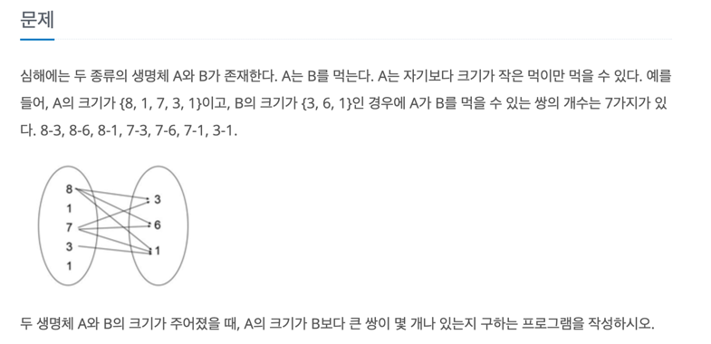

# 먹을 것인가 먹힐 것인가
- 링크: https://www.acmicpc.net/problem/7795   
- 난이도: 실버3


### 사용한 알고리즘
## 투포인터

1. 시간 복잡도 가늠해보기 <br/>
문제에서 주어진 시간 제한은 1초이고 입력값 N은 최대 20,000 이 될 수 있다.<br/>
1초에 일반적으로 2억번의 연산이 가능하다고 가정할 때,<br/>
N의 제곱 시간복잡도로 코드를 짜게 되면 <br/>
``` 
20,000 x 20,000 = 400.000,000 (4억)
```
4억 이라는 수가 나오게 된다. 최악의 경우에서 무조건 시간 초과가 걸리는 상황이다.<br/>
이에 이중 반복문을 사용하는 일은 피해야한다고 생각했다.

최대한 탐색하는 방향이 뒤로 돌아가는 것 없이 선형으로 구성해야 했다.

2. 알고리즘 고민하기
해당 문제의 특성 상 한번 정렬된 상태라면 비교하는 두개의 포인트가 선형적으로 나아가며 값을 비교하면 될 것 같았다.<br/>
이에 투포인터 알고리즘을 떠올려 적용하게 되었다.

3. 코드 작성하기
본 문제는 입력값이 많아서 주의하며 설계해야 했다.
그래서 입력값을 다루는 모듈이 있으면 좋을 것 같아 아래와 같은 함수를 작성했다.

```aidl
static int[] setArr(int size, String[] args) 
```
이 함수는 첫번째 배열A와 두번째 배열B를 완성하는 모듈이다.
- ```int size```: 배열의 길이
- ```String[] args```: 입력값을 ```split(" ")```으로 배열로 바꾼 상태<br/><br/>

매개변수로 받은 args 는 반복문을 돌면서 parseInt() 를 활용해 형변환한다.
반환하는 배열은 새로운 배열로 만들어 retrun 한다.

본 알고리즘의 핵심은 정렬된 상태에서 이뤄져야 효과가 있는 것이다.<br/>
투포인터 알고리즘은 이전 상태 결과가 다음에 진행할 작업에서도 반영되어 다음 단계로 넘어가기 때문이다.<br/>
정렬되지 않는다면 양 옆 원소가 가져오는 결과가 현재 원소와 관련한 결과와 독립적인 결과가 되기 쉽다.<br/>
<br/>
이에 Arrays.sort() 알고리즘을 사용해 정렬했다.


- ```int[] nums```: 
  - 배열 A의 크기와 배열 B의 크기
  - nums[0]: 배열 A의 크기
  - nums[1]: 배열 B의 크기

A의 크기가 B보다 큰 쌍이 몇 개나 있는지 구하는 프로그램을 작성하시오.
3 4 5
1 2 3 4 5

